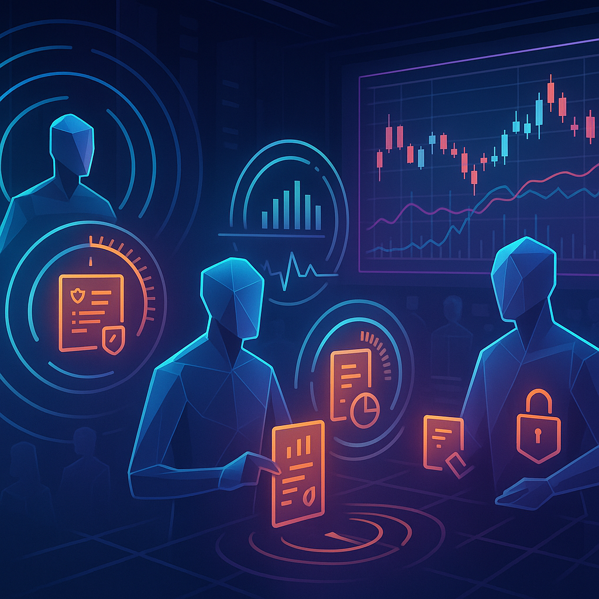
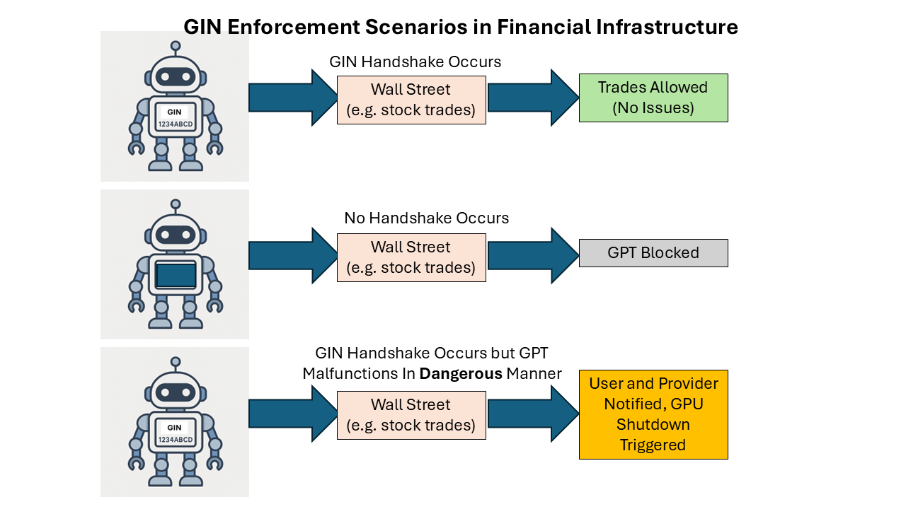

# .aix Payloads: The New Digital Trading Pit




## From Shouting Pits to Payloads

In the old days of Wall Street, the trading floor was pure chaos.  
Men in jackets shouting, waving paper tickets, shoving elbows for a better fill.  
Seconds mattered. Human lungs, sweat, and paper slips were the throttle.

Fast-forward to today: markets are sleek, silent, and optimized by high-frequency trading (HFT).  
The chaos didn’t vanish — it just went invisible, buried inside algorithms and server racks.

But a new layer is emerging.

`.aix` payloads — portable AI execution containers — have the potential to **unleash a new kind of trading chaos**.  
Not human lungs. Not sterile HFT. But GPT-driven agents trading live, scoped, and auditable.

The pit energy comes back — **this time at GPU speed.**

---

## What Makes `.aix` Different?

A `.aix` file isn’t just code. It’s a **contract + container**:

- Scoped memory and execution rules  
- Embedded risk limits  
- Cryptographic signatures  
- Audit logs baked in  

That means you can package a trading strategy in `.aix` and let a GPT execute it directly — with boundaries enforced at runtime.

Think **Docker for AI agents.** If algos were brittle scripts, `.aix` payloads are portable, upgradeable trading “organisms.”

---

## The Problem: False Demand & Flash Swarms

Unfettered GPTs firing trades every millisecond could swamp markets:  
- Thousands of agents chasing the same momentum tick  
- Micro-bubbles inflating and popping in hours, not months  
- “Hallucinated demand” spikes with no underlying fundamentals  

This is the modern equivalent of 500 traders screaming “BUY!” at once.

---

## The Fix: Timing Rules Inside `.aix`

Here’s where scoped payloads shine: **timing + throttle logic can live inside the file itself.**

```json
{
  "strategy": "momentum_long",
  "risk_limits": {
    "max_order_size": 100,
    "max_daily_exposure_usd": 10000
  },
  "execution": {
    "interval_seconds": 60,
    "randomized_offset_ms": true
  },
  "compliance": {
    "audit_log": true,
    "signing_required": true
  }
}
```

**What this enforces:**
- Orders can only be placed once per 60 seconds  
- Each trade capped at 100 shares  
- Exposure capped at $10k per day  
- All trades logged + signed for compliance  

The result: **pulsed, human-like rhythms** in AI trading.  
Not chaos seizures, but programmable heartbeats.

---

## Why This Matters

1. **Regulatory comfort**  
   SEC/CFTC want audit trails. `.aix` provides them natively.  
   Compliance becomes code.

2. **Market structure stability**  
   Timing rules prevent swarm demand spikes.  
   Think “pit rules,” but digital.

3. **Innovation unlocked**  
   Hedge funds can swap `.aix` modules like Lego blocks.  
   Retail could someday download safe, scoped “strategy packs.”


---

## Enforcing Safety with GIN

`.aix` is not only about programmable trading chaos—it’s about **guardrails**.

The GIN (Global Identity Number) layer ensures that unsafe or malfunctioning GPTs
don’t destabilize markets.  



**Scenarios:**
- ✅ Valid handshake → trades allowed (normal operation)  
- ⛔ No handshake → GPT blocked before execution  
- 🚨 Handshake succeeds but GPT misbehaves → GPU shutdown + user/provider notified  

This enforcement makes `.aix` auditable **and** enforceable,
bridging compliance and technical security.

---

## The Vision

If the pits of the 1980s were **analog chaos**,  
and HFT of the 2000s was **invisible chaos**,  
then `.aix` brings **programmable chaos with brakes.**

The market gets its energy back — but in packets.  
Every payload a trader. Every GPT a pit voice.  
All logged. All bounded. All auditable.

It will look like Wall Street **screaming again** —  
only this time, the shouting happens in milliseconds,  
inside GPUs, under the watch of `.aix`.

---

## Closing Thought

This is not hype. It’s plumbing.  
Just as Docker reshaped software, `.aix` could reshape markets.  

The question isn’t *if* AI agents will trade.  
It’s **how we package them so chaos is fun — and safe.**

